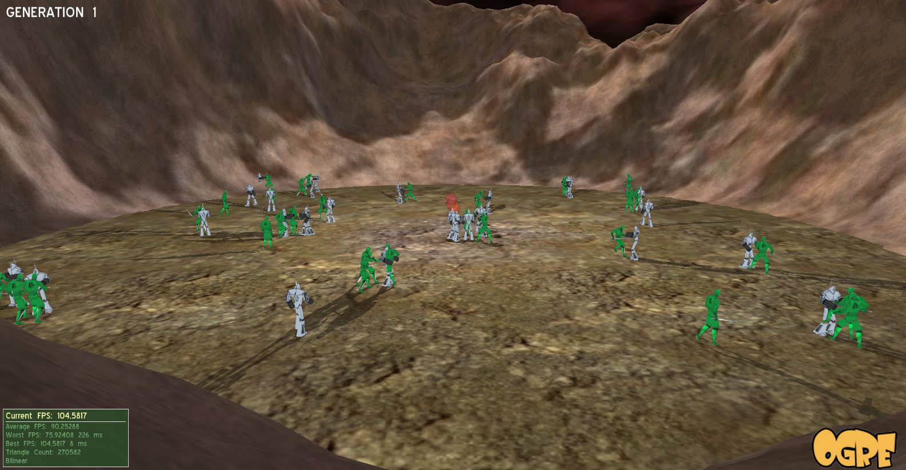
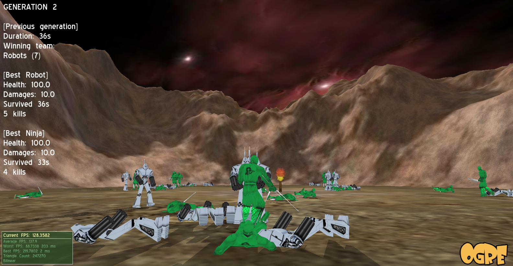
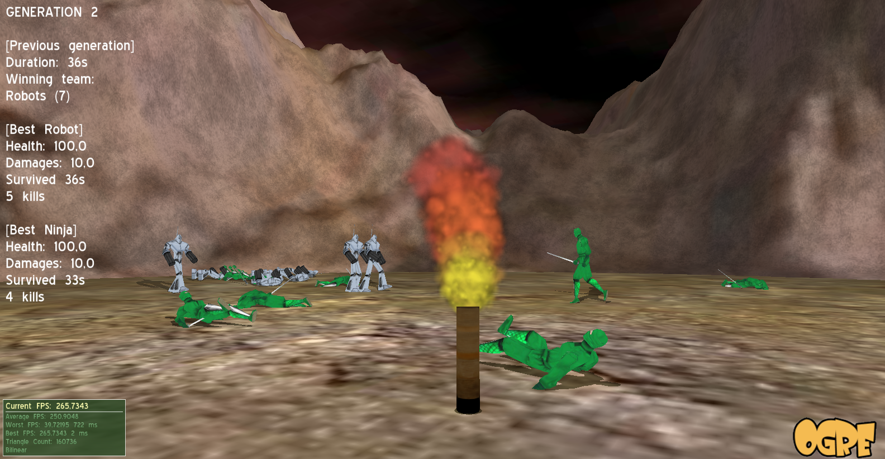
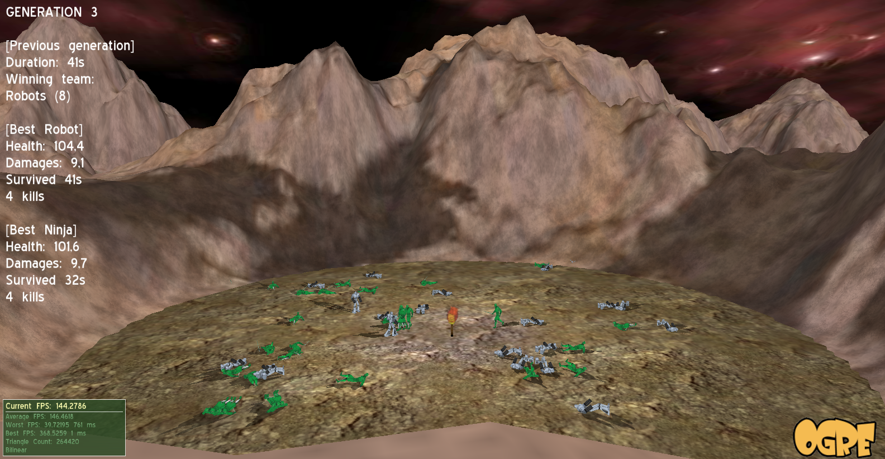

ogre-robo
=========

Software development project for the robotic option at the ENSEIRB-Matméca graduate school from Bordeaux (France).

Description
-----------

This project is an academic assignment which aims to give an exemple of a genetic algorithm using a multi-agent system. In addition, it is an illustration of the Ogre3D graphics engine, using the Mogre C# API with Visual Studio. 

To sum up the behavior of the agents, there are two teams fighting one another. At the end of each round, when a team has been defeated, the algorithm generates a new round with agents resulting from a genetic mutation of the best element of the precedent round. The genes are set up to ensure some balance, i.e. a stronger agent is slowlier, a weaker one is faster, etc.

Screenshots
-----------

|   |
|:-------------------------------:|
|   |
|   |
|   |

